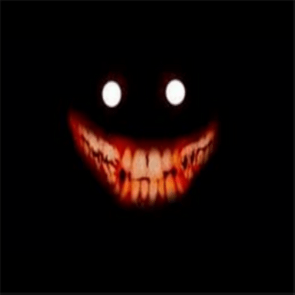

# Paranoia.ps1
### Spooky Malware Script For Windows
`Paranoia.ps1` is a horror-themed Powershell fake-malware script intended to make you feel like your computer is haunted, or that you're going crazy.

It's perfect for playing around with, pranking friends, or using in the background while you play horror games or read creepypastas (especially digital horror themed stuff).
> [!CAUTION]
> `Paranoia.ps1` is intended to provide an unsettling and anxiety inducing experience.
> Some of its payloads are designed to resemble visual and auditory hallucinations.
> If you are susceptible to **fear**, **anxiety**, **delusions**, **hallucinations**, and **Paranoia**, it is generally recommended that you **do not use this script**.
>
> I am **not responsible** for any negative physical, digital, or psychological effects suffered as a result of using this script, including, but not limited to:
> - **Data Corruption / Loss of Data**
> - **Fear**
> - **Anxiety**
> - **Delusions**
> - **Hallucinations**
> - **Existential Dread And Horror**
> - **Inability to Distinguish Between Dreams and Reality**
> - **Insanity**
> - **Death**
> - **Paranoia** 
## Features:
- **13** Unique Payloads, including pop-up windows, barely audible TTS speech, opening the camera app, ejecting any connected CD drives, changing your wallpaper, sending keyboard inputs, and many more.
- **Highly** Configurable. Every payload can be individually configured for maximum effect, including enabling/disabling each payload, changing the timeout intervals for each payload, changing the chance for a payload to trigger each interval, changing the wallpaper for the wallpaper payload, and many more. Tailor `Paranoia.ps1` to your ~~victim~~ friend and watch their reaction!
- **Silent** Execution. `Paranoia.ps1` runs silently in the background. You'll forget that it's there, until it **GETS YOU!**
- **Persistent** Execution. `Paranoia.ps1` can be set to **run on startup**, meaning **Not Even A Restart Will Save You!**
- **Not** Destructive. `Paranoia.ps1` doesn't damage your system at all, meaning you can run it for a while, and then just delete it and easily clean things up, **like it was all just a dream!**

For a full guide on configuring and modifying `Paranoia.ps1`, view [`Paranoia Script Guide.pdf`](Paranoia_Script_Guide.pdf).

## How To Run:
`Paranoia.ps1` can be run by running `Gaslight.bat` which runs the `Paranoia.ps1` script with `ExecutionPolicy Bypass`.
> [!NOTE]
> Certain payloads may behave differently depending on whether `Paranoia.ps1` was run as **Administrator** or not, based on your system's environment.
> It is recommended that you test running `Paranoia.ps1` as both **Administrator** and **Non-Administrator** to see how these payloads behave differently.
> `Paranoia.ps1` can be run as **Administrator** by **Right-Clicking** `Gaslight.bat` and clicking **Run As Administrator**.

`Paranoia.ps1` can be stopped by running `RemoveGaslight.bat`, which kills the process, removes the run-on-startup script (if it exists), and runs `FixMouse.ps1` if it is in the same folder.

`FixMouse.ps1` undoes the mouse-button-swap payload, resetting your mouse buttons to the default left-right configuration (this setting can be manually changed in Windows Settings / Control Panel)

For more information on running `Paranoia.ps1`, view [`Paranoia Script Guide.pdf`](Paranoia_Script_Guide.pdf).

## Requirements:
- Windows Powershell 3.0 (Minimum)
- Windows Powershell 5.1 (Recommended)
- Classic Windows Media Player (wmplayer.exe) and a CD drive (For CD drive eject payload)
- Microsoft Word (desktop, not online) (For Word document write payload)
- A PNG/JPG image file in the same folder as `Paranoia.ps1` (For wallpaper payload)
- Windows Camera App (For camera app payload)
- A WMI scriptable monitor (For monitor brightness payload)
- At least 1 connected printer (For printer payload)
##
I hope you enjoy!
\
\
\
\
\
\
\
\
\
\
\
\
\
\
\
\
\
\
\
\
\
\
\
\
\
\
\
\
\
\
\
\
\
\
\
\
\
\
\
**H E   C O M E S**
> [!WARNING]
> IAMINSIDEYOURWALLSIAMINSIDEYOURWALLSIAMINSIDEYOURWALLSIAMINSIDEYOURWALLSIAMINSIDEYOURWALLSIAMINSIDEYOURWALLSIAMINSIDEYOURWALLSIAMINSIDEYOURWALLSIAMINSIDEYOURWALLSIAMINSIDEYOURWALLSIAMINSIDEYOURWALLSIAMINSIDEYOURWALLSIAMINSIDEYOURWALLSIAMINSIDEYOURWALLSIAMINSIDEYOURWALLSIAMINSIDEYOURWALLSIAMINSIDEYOURWALLSIAMINSIDEYOURWALLSIAMINSIDEYOURWALLSIAMINSIDEYOURWALLSIAMINSIDEYOURWALLSIAMINSIDEYOURWALLSIAMINSIDEYOURWALLSIAMINSIDEYOURWALLSIAMINSIDEYOURWALLSIAMINSIDEYOURWALLSIAMINSIDEYOURWALLSIAMINSIDEYOURWALLSIAMINSIDEYOURWALLSIAMINSIDEYOURWALLSIAMINSIDEYOURWALLSIAMINSIDEYOURWALLSIAMINSIDEYOURWALLSIAMINSIDEYOURWALLSIAMINSIDEYOURWALLSIAMINSIDEYOURWALLSIAMINSIDEYOURWALLSIAMINSIDEYOURWALLSIAMINSIDEYOURWALLSIAMINSIDEYOURWALLSIAMINSIDEYOURWALLSIAMINSIDEYOURWALLSIAMINSIDEYOURWALLSIAMINSIDEYOURWALLSIAMINSIDEYOURWALLSIAMINSIDEYOURWALLSIAMINSIDEYOURWALLSIAMINSIDEYOURWALLSIAMINSIDEYOURWALLSIAMINSIDEYOURWALLSIAMINSIDEYOURWALLSIAMINSIDEYOURWALLSIAMINSIDEYOURWALLSIAMINSIDEYOURWALLSIAMINSIDEYOURWALLSIAMINSIDEYOURWALLSIAMINSIDEYOURWALLSIAMINSIDEYOURWALLSIAMINSIDEYOURWALLSIAMINSIDEYOURWALLSIAMINSIDEYOURWALLSIAMINSIDEYOURWALLSIAMINSIDEYOURWALLSIAMINSIDEYOURWALLSIAMINSIDEYOURWALLSIAMINSIDEYOURWALLSIAMINSIDEYOURWALLSIAMINSIDEYOURWALLSIAMINSIDEYOURWALLSIAMINSIDEYOURWALLS

